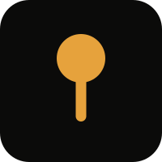

  

# citatum

**Citation is not a merge.** One identifier joins four stores.

| Store | Question | Write |
|---|---|---|
| [packset](https://github.com/HaoZeke/packset) | What does this seat know, standing? | `Remember:` / `Prefer:` only |
| [deedar](https://github.com/indynull/deedar) | What did this unit produce? | Frozen bytes. `deedar evidence` / `deedar current` |
| [vissue](https://github.com/HaoZeke/vissue) | What does this node stand on, and who agrees? | Graph. A deed citation, not a paste |
| [claimdag](https://github.com/HaoZeke/claimdag) | What is this session handing out? | `claim` / `complete`. Completing does not close a ticket |

The identifier is an **accession**: `deed-…` or `sha256:`. The pack names it. The tracker cites it. The deed store answers for the bytes.

## Mark

The fastener the four already share. Ink `#0B0B0A`, cream `#F4F0E6`, gold `#E6A23C`.

- [icon.svg](docs/logo/icon.svg) — the pin
- [lockup.svg](docs/logo/lockup.svg) — pin and word

Product marks stay in their trees. packset and claimdag already use the pin. deedar is a receipt through a seal. The tracker keeps the lattice; the ready node carries the pin.

## GitHub

This repository is the family page. The GitHub organization is [indynull](https://github.com/indynull). It already exists and already holds deedar. `accession` is a user. `citatum` is reserved on the org-create form even though `/users/citatum` 404s. Do not open a second org.
